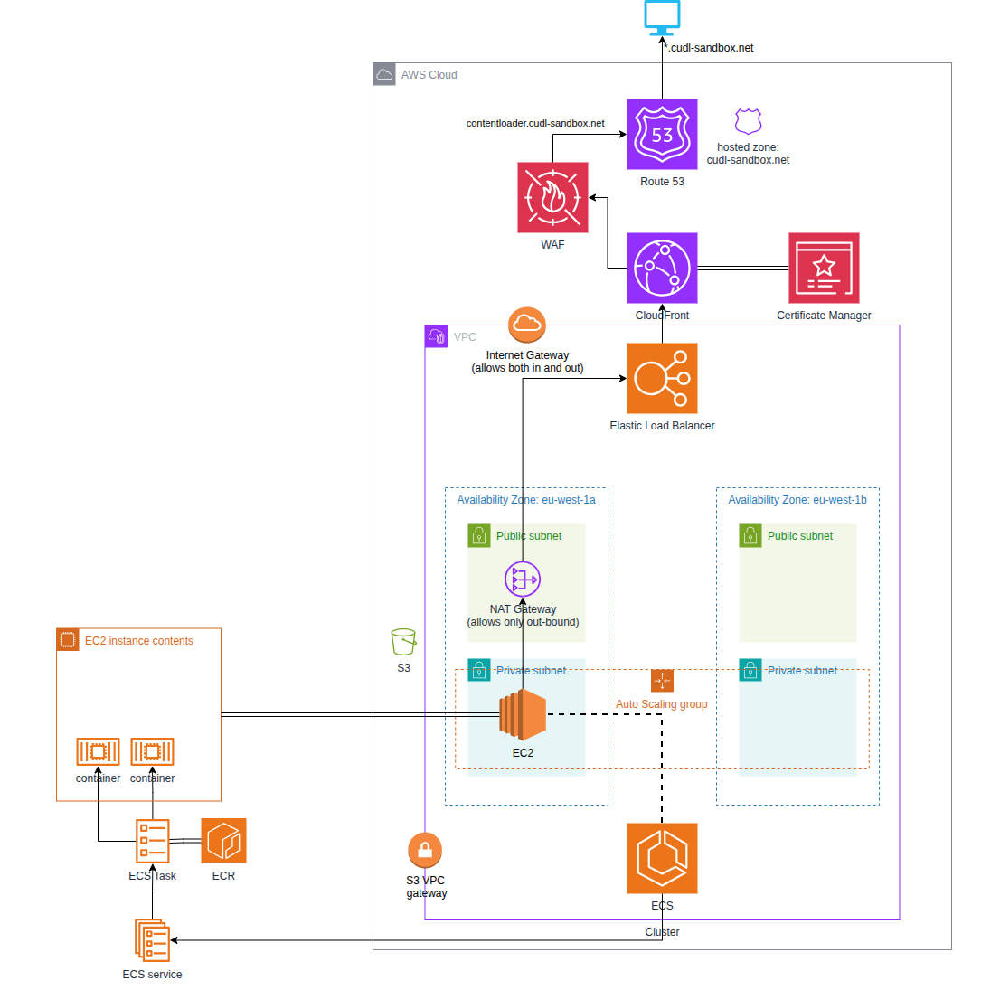

# CUDL Infrastructure Configuration

This is the Terraform configuration for the Cambridge Digital Library Platform.
Initially this will only cover the setting up the data loading process.

## Architecture overview

The following diagram shows the high-level AWS architecture that this Terraform configuration builds and manages:

## Prerequisites 

Install Terraform: https://learn.hashicorp.com/tutorials/terraform/install-cli

For a full list of AWS resources and configuration you must create **before** running Terraform (state backend, ECR images, SSM parameters, certificates, etc.), see:

[CUDL Terraform Environment Setup - `docs/environment-setup.md`](docs/environment-setup.md) 

## Commands

First select the environment you want to work in: dev, stage or prod.  It's recommended you 
work and test and changes in dev first!

    cd cudl-sandbox

To initialise the working directory run the following in the root directory of this project.

    terraform init

You can confirm the configuration is valid with 

    terraform validate 

You can see what changes have occurred from the terraform file state to the current state by running
It saves the plan generated to a binary file.

    terraform plan -out=myplan 

You can inspect the plan file using the command

    terraform show myplan 

To apply those changes run  **warning this will update the system** 

    terraform apply myplan 

If you want to bring down all components **warning this will detroy all managed components**
    
    terraform destroy

For more information see

https://www.terraform-best-practices.com/

## State

State is stored in S3, and will be picked up automatically from the init command.
It is backend "s3" section of the main.tf file.

## Running Terraform in sandbox environment

Resource naming in the sandbox environment (AWS Account 563181399728) has been changed to include the user's CRSid. When running Terraform commands, you will be prompted to enter a value for the `owner` for which the CRSid should be provided. This will be added as a prefix in resource names. Other environments, dev, staging and production are not prefixed with the owner value. In the sandbox environment, a tag Owner will also be added to resources. This will not be used in dev, staging and production.

## Running Terraform Tests

Before applying the Terraform in each environment, it is advisable to run tests to validate that the modules being used generate expected outputs.

Terraform tests can be run in cudl-dev, cudl-staging and cudl-production. This can be done by entering the directory of choice, e.g.

    cd cudl-sandbox

Then entering a command 

    terraform test dev

Which will run a suite of tests against that environment. The test file in this case is located in the path `cudl-dev/tests/dev.tftest.hcl`.

Currently the tests are intended to be run using an IAM role from the sandbox environment (AWS Account 563181399728). Variables from each environment are used, with overrides from the test file enabling the tests to be run in the sandbox environment.

Currently all tests run Terraform plan, although they could be adapted to run apply if desired.

## Data loading process

The data loading process (the `cudl-data-processing` module and related Lambdas) is documented in detail here:

- [CUDL Data Loading and `cudl-data-processing` module - `docs/data-loading.md`](docs/data-loading.md)

## External resources and prerequisites

This Terraform assumes several AWS resources already exist, such as:

- The shared Terraform state backend (S3 bucket + DynamoDB lock table)
- ECR repositories and images for CUDL services, viewer, SOLR, and content loader
- S3 bucket for lambda JARs / Maven artifacts
- SSM Parameter Store entries for passwords, API keys, and viewer configuration

For a complete, up-to-date list of external resources and how to wire them into each environment’s `terraform.tfvars`, see:

[CUDL Terraform Environment Setup - `docs/environment-setup.md`](docs/environment-setup.md) 
