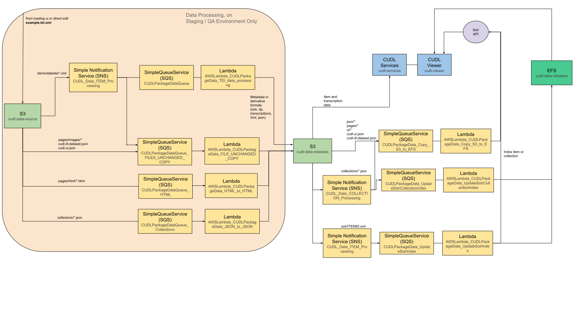

# CUDL Data Loading / `cudl-data-processing` Module

This document describes the data loading process and the infrastructure created by the `modules/cudl-data-processing` module and related components.

It complements the high-level project overview in `README.md`.

---

## Overview

The data loading process converts source CUDL data into the formats used by the viewer and downstream systems. Examples include:

- Transforming TEI into JSON for the viewer
- Copying or transforming HTML and JSON artefacts
- Indexing content into SOLR
- Handling Transkribus data for enhanced transcriptions

The core Terraform for this lives in:

- `modules/cudl-data-processing`
- Environment-specific wiring (buckets, VPC, certificates, etc.) in directories such as `cul-cudl-staging/`.

For application-level transformation logic see:

- https://github.com/cambridge-collection/data-lambda-transform
- https://github.com/cambridge-collection/cudl-solr-listener
- https://github.com/cambridge-collection/transkribus-import

---

## High-level architecture

The module and its callers create and connect the following AWS resources:

- **S3 buckets**
  - Source CUDL data (pre-processing)
  - Destination / releases data (post-processing)
  - Enhancements / Transkribus data
- **Lambda functions**
  - Java JAR-based Lambdas from `data-lambda-transform`
  - Container-based Lambdas (TEI processing, SOLR listeners, Transkribus ingest)
- **SQS and SNS**
  - Queues per processing stage (e.g. HTML, collections, index, copy-to-EFS)
  - Optional SNS topics for S3 event fan-out
- **EFS**
  - Encrypted file system with mount targets in the CUDL VPC
  - Access point for use by Lambdas and ECS workloads
- **DataSync**
  - S3 → EFS tasks for copying releases data to the shared EFS volume
- **CloudFront & WAF**
  - Optional distribution exposing processed artefacts
  - WAFv2 WebACL protecting the distribution
- **Route53 & ACM**
  - DNS records and certificates if CloudFront is enabled
- **IAM**
  - Roles and policies for Lambdas and DataSync
- **CloudWatch**
  - Dashboards for Lambda and SQS metrics

This diagram shows this infrastructure end to end.

---

## Lambda functions

The data loading stack uses a combination of JAR-based and container-based Lambda functions. The core ones are:

| Lambda name                                           | Type      | Runtime | Source Code                                                   |
| :---------------------------------------------------- | :-------- | :------ | :------------------------------------------------------------ |
| AWSLambda_CUDLPackageData_Collection_SOLR_Listener    | Container | Docker  | https://github.com/cambridge-collection/cudl-solr-listener    |
| AWSLambda_CUDLPackageData_COPY_FILE_S3_to_EFS         | Java Jar  | Java 11 | https://github.com/cambridge-collection/data-lambda-transform |
| AWSLambda_CUDLPackageData_DATASET_JSON                | Java Jar  | Java 11 | https://github.com/cambridge-collection/data-lambda-transform |
| AWSLambda_CUDLPackageData_FILE_UNCHANGED_COPY         | Java Jar  | Java 11 | https://github.com/cambridge-collection/data-lambda-transform |
| AWSLambda_CUDLPackageData_HTML_to_HTML_Translate_URLS | Java Jar  | Java 11 | https://github.com/cambridge-collection/data-lambda-transform |
| AWSLambda_CUDLPackageData_JSON_to_JSON_Translate_URLS | Java Jar  | Java 11 | https://github.com/cambridge-collection/data-lambda-transform |
| AWSLambda_CUDLPackageData_SOLR_Listener               | Container | Docker  | https://github.com/cambridge-collection/cudl-solr-listener    |
| AWSLambda_CUDLPackageData_TEI_Processing              | Container | Docker  | https://github.com/cambridge-collection/transkribus-import    |
| AWSLambda_CUDL_Transkribus_Ingest                     | Container | Docker  | https://github.com/cambridge-collection/transkribus-import    |
| AWSLambda_CUDLPackageData_UI_JSON                     | Java Jar  | Java 11 | https://github.com/cambridge-collection/data-lambda-transform |
| AWSLambda_CUDLPackageData_UPDATE_DB                   | Java Jar  | Java 11 | https://github.com/cambridge-collection/data-lambda-transform |

Each environment wires these functions through the `transform-lambda-information` variable in its `terraform.tfvars` file (for example `cul-cudl-staging/terraform.tfvars`), specifying:

- Name, timeout, memory, and concurrency settings
- Whether the function uses a JAR (`jar_path` + `runtime`) or a container image (`image_uri`)
- Queue name and VPC networking (VPC, subnets, security groups)
- Environment variables and optional EFS mount configuration

---

## AWS resources created by the module

The `cudl-data-processing` module and its supporting code create:

- **IAM**
  - Execution roles for all Lambdas, with permissions for:
    - S3 read/write on source, destination, and enhancements buckets
    - SQS receive/delete
    - CloudWatch Logs
    - VPC networking and EFS access
  - DataSync role and policy for S3 → EFS transfers

- **Storage**
  - S3 buckets for:
    - Source (`<env>-<source-bucket-name>`)
    - Destination/releases (`<env>-<destination-bucket-name>`)
    - Enhancements (`<env>-<enhancements-bucket-name>`)
  - EFS file system, access point, and mount targets in the CUDL VPC

- **Messaging and events**
  - SQS queues and dead-letter queues, one per logical processing queue
  - SNS topics and subscriptions used by S3 notifications where configured
  - S3 bucket notifications wired to SQS and SNS

- **Compute**
  - Lambda functions and aliases for each entry in `transform-lambda-information`
  - Lambda layer containing generated properties files (e.g. bucket names, prefixes)

- **Data transfer**
  - DataSync locations (S3 and EFS)
  - DataSync tasks for bulk copy of releases S3 → EFS

- **Edge & security**
  - Optional CloudFront distribution in `us-east-1` exposing the destination bucket
  - WAFv2 WebACL for the distribution
  - Route53 records and ACM certificates (if configured to be created)

- **Monitoring**
  - CloudWatch dashboards for Lambda and SQS metrics

For the exact resource definitions, see:

- `modules/cudl-data-processing/*.tf`
- Environment-specific variables in `cul-cudl-*/terraform.tfvars`

---

## Existing / external resources expected

The module expects several external resources to exist and be referenced via variables:

- ECR repositories and images for container-based Lambdas
- S3 Maven/JAR bucket containing built Lambda artefacts
- (Optionally) S3 buckets containing XSLT artefacts used by the transformation code

These are documented in more detail in:

- `docs/environment-setup.md`

